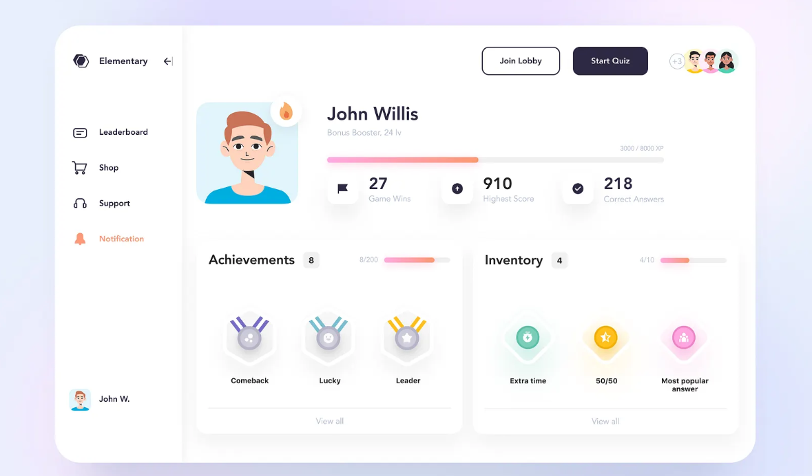

# [  Quiz Interactif ]

[]()
[]()
[](LICENSE)




**Une application web interactive de quiz pour tester vos connaissances.**

## 📋 Table des Matières
- [✨ Fonctionnalités](#-fonctionnalités)
- [🚀 Démo](#-démo)
- [🛠️ Installation](#️-installation)
- [🎮 Utilisation](#-utilisation)
- [🏗️ Structure](#️-structure)
- [📁 Fichiers](#-fichiers)
- [🔧 Configuration](#-configuration)
- [🧪 Tests](#-tests)
- [🤝 Contribution](#-contribution)
- [📄 Licence](#-licence)
- [👥 Auteurs](#-auteurs)

## ✨ Fonctionnalités

### ✅ Fonctionnalités de Base
- [x] **Questions à choix multiples** (3-4 options)
- [x] **Vérification instantanée** des réponses
- [x] **Navigation** entre les questions
- [x] **Calcul automatique** du score
- [x] **Possibilité de rejouer**

### 🚀 Fonctionnalités Avancées
- [ ] **Minuteur** par question
- [ ] **Barre de progression**
- [ ] **Questions aléatoires**
- [ ] **Récapitulatif détaillé**
- [ ] **Effets visuels**
- [ ] **Catégories de quiz**
- [ ] **Sauvegarde des scores**
- [ ] **Design responsive**

## 🚀 Démo

### 🖼️ Captures d'écran


### 🔗 Lien de démo
**[Voir la démo en ligne](https://votre-demo.com)**

## 🛠️ Installation

### Prérequis
- Navigateur web moderne (Chrome 80+, Firefox 75+, Safari 13+)
- Éditeur de texte (VS Code, Sublime Text, etc.)

### Étapes d'installation
1. **Télécharger le projet**
   ```bash
   git clone https://github.com/Mouad-MCH/Interactive_Quiz.git]
   cd Interactive_Quiz
